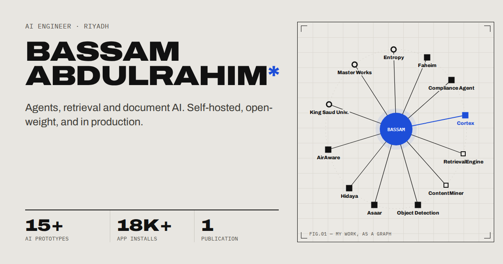

# Bassam Abdulrahim — Portfolio

My personal site, built around one idea: **my work, drawn as a graph**. I sit at the centre; the organisations I've worked with, the projects and libraries I've built, and the tools behind them branch out from there.

**Live:** [bassamalim.web.app](https://bassamalim.web.app)



## What's on the page

- **Knowledge graph.** Hover a node to trace its connections, click it to open the inspector, and filter by discipline (agents, retrieval, document AI, vision, mobile, ML research).
- **Trajectory.** A career timeline you can scrub or replay from 2019. The graph and the project index grow year by year to match.
- **Project index.** Every project and library, linked both ways with the graph.
- **Publication and contact.** The Wiley paper, plus email (with one-click copy), GitHub, LinkedIn and my résumé.
- **Light and dark themes.** Each has its own type pairing (Archivo and IBM Plex Mono in light, Geist and Geist Mono in dark). Switching grows the new theme out in a circle from the toggle, using the View Transitions API.
- **Phone layout.** A layout designed for phones, not a squeezed desktop page. It has a compact graph, a bottom-sheet inspector, work cards and a full-screen menu, all built on native `<dialog>`.
- **Custom 404.** "Node not found", the graph with a missing edge. It's served as a real 404.

Motion respects `prefers-reduced-motion`, the theme honours the system setting on first visit, and everything interactive is a real `<button>` or `<a>`.

## Stack

| | |
|---|---|
| Framework | [React 19](https://react.dev) + TypeScript |
| Build | [Vite](https://vite.dev) |
| Styling | Plain CSS with custom-property theme tokens (no CSS framework) |
| Hosting | [Firebase Hosting](https://firebase.google.com/docs/hosting) |

The only runtime dependencies are `react` and `react-dom`.

## Getting started

Requires Node 20.19+ or 22.12+.

```bash
npm install
npm run dev       # start the dev server
npm run build     # type-check and build to dist/
npm run preview   # serve the production build locally
```

## Deploying

```bash
npx firebase login   # once per machine
npm run deploy       # build, then deploy to Firebase Hosting
```

## Project structure

```
index.html            main page (sets the theme before first paint)
404.html              not-found page, a second Vite entry
public/               favicon, social preview image, résumé PDF
src/
  data.ts             all content: nodes, relations, timeline, stats, paper
  App.tsx             page layout (desktop and phone), inspector, sections
  Graph.tsx           the interactive graph (full and compact modes)
  NotFound.tsx        404 page
  theme.tsx           theme state, view-transition toggle
  styles.css          theme tokens, layout, animation, responsive rules
```

## Editing content

All content lives in [`src/data.ts`](src/data.ts):

- **Add a project:** add an entry to `RAW` and a spoke in `ME` (how I relate to it). Add its tools to `OTHER`, and give it an angle in `ANG` for where it sits on the ring.
- **Add a tool:** add a `Tech` node to `RAW`, connect it in `OTHER` and give it an angle in `ANG`. Its first year is worked out from the projects that use it.
- **Timeline, stats, paper:** `LADDER`, `KPIS` and `PAPER`.

## Design

Designed in [Claude Design](https://claude.ai) over ten rounds of iteration, then implemented here by hand.

## License

© Bassam Abdulrahim. The code is here to read and learn from. Please don't reuse the content (text, résumé, images) or redeploy the site as your own.
